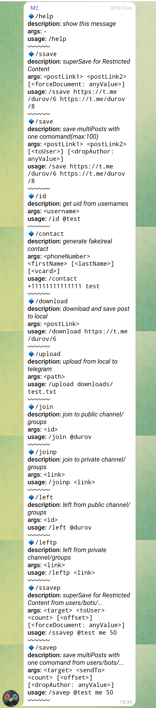

# telAdviser
## یه دستیارتلگرام برای راحتی بیشتر :)

**ویژگی‌ها:**
 - کانال/گروه هایی که محدودیت گذاشتن و فوروارد پستاشونو بستن راحت دور بزنید
 -  پستهای کانال و گروهای پابلیک و پرایوت به هرجایی که خواستید فوروارد کنید تا بکاپ داشته باشید
 -   تایمتونو سر سلکت کردن پست‌ها هدر ندید
 - ...

## نحوه اجرا

[هش و ایدی خودتونو از سایت تلگرام بگیرید](https://my.telegram.org/)

فایل کانفیگ رو ادیت کنید و دستورات زیر برای اجرا بزنید:

 1. [install nodejs](https://nodejs.org/en/download)
 
 2. change production config:
 ```
 nano config/production.json
 ```

 3.
 ```
 npm i
 ```
 4. 
 ```
npm start
 ```

الان میتونید از قسمت سیومسیج‌هاتون با زدن دستور/help دستورات و نحوه کار باهاشونو یاد بگیرید 



